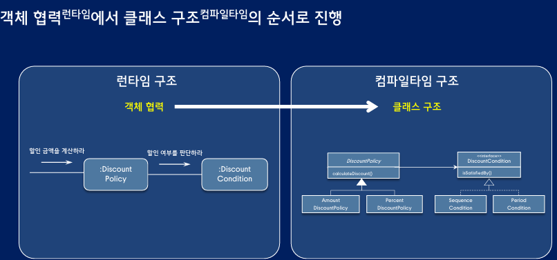
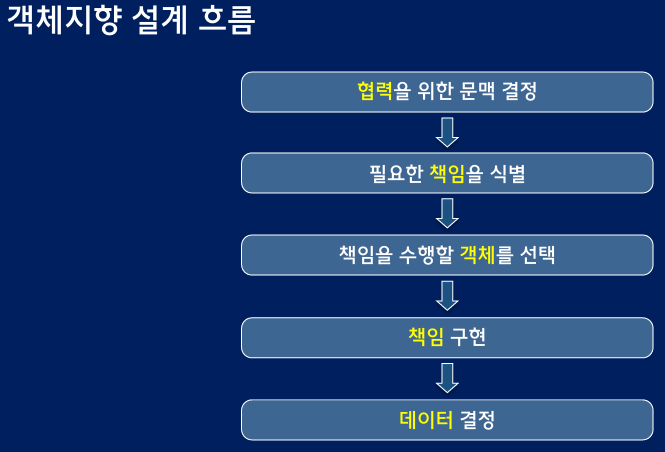
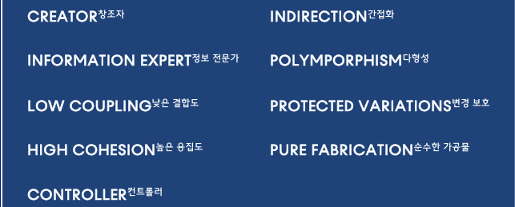

## 설계란 ? 
- 코드를 배치하는 방식
- 코드를 쉽고 안전하게 수정하기 위해 필요

## 객체지향의 핵심은 변경 관리
- 설계원칙
  - 행동을 먼저 결정하고 객체를 나중에 선택 -> 객체 사이의 협력
  - 행동을 먼저 구현하고 데이터를 나중에 선택 -> 클래스 내부 구현
  

DiscountPolicy를 참조하는 프로세스를 DiscountPolicy 내부로 이동 
-> 책임의 이동

진정한 객체지향 설계는 제한된 문맥 안에서 설계

## 책임 주도 설계

- 책임이란 ? 
  - 협력에 참여하기 위해 객체가 수행하는 행동
  - 세부사항과 관련된 결정을 미루고 객체들의 협력 구조에 초점

- 책임 주도 설계
  - 애플리케이션의 기능 파악
  - 기능 요구사항을 시스템의 책임으로 변환
  - 시스템의 책임을 객체의 책임으로 변환
  - 책임을 담당할 객체 선택
  - 책임 수행 중 외부 도움이 필요할 경우 다른 객체에 요청

- 책임 주도 설계의 핵심
  - 책임 할당 -> 어떤 객체에 어떤 책임을 할당할 것인가
  
## 표현적 차이 줄이기
- 표현적 차이
  - 도메인에 대한 개념적 모델과 SW 구현 사이의 거리
  - 변경하기 쉬운 유연한 설계를 위해 표헌적 차이를 줄여야 함

수정 할 코드의 위치 파악 용이 (명사를 이용해 동사 묶기)

### GRASP (General Responsibility Assignment Software Pattern)

  